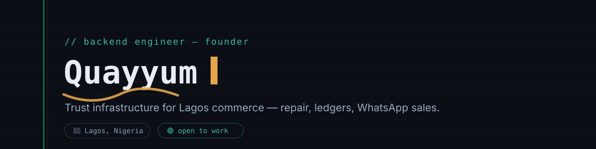

<h1 align="center">Quayyum</h1>
<p align="center">Backend &amp; Full-Stack Engineer · Founder · Lagos, Nigeria 🇳🇬</p>

<p align="center">
  
</p>

<p align="center">
  
</p>

<p align="center">
  <a href="https://quayyumsportfolio.netlify.app"></a>
  <a href="https://www.linkedin.com/in/quayyum-ariyo-81659337a/?lipi=urn%3Ali%3Apage%3Ad_flagship3_feed%3BcTrRGbWxQ9G%2BdsaNriIxWg%3D%3D"></a>
  <a href="mailto:quayyumariyo@gmail.com"></a>
  
</p>

---

### About

I'm a backend-leaning full-stack engineer based in Lagos, with three-plus years shipping production systems across fintech, logistics, and real estate platforms. My primary stack is Node.js/NestJS and Java/Spring Boot on the backend, React and React Native on the front, and Supabase/PostgreSQL or MongoDB underneath.

Most of my own work right now sits at the intersection of trust infrastructure and financial inclusion — replacing the paper processes that Nigeria's informal economy still runs on with software that respects how that economy actually operates: offline-first, WhatsApp-native, and allergic to friction. That means marketplaces where verification and escrow *are* the product, not a checkbox, and ledgers that feel like ink on paper because that's what actually gets adopted by a shop owner who's kept a physical book for fifteen years.

### 🔭 Current Focus

- 🏗️ **Building** — UrbanFix: implementing the in-app technician-approval flow and cleaning up routing/console warnings ahead of MVP validation
- 📐 **Also building** — Digital Ledger: full 13-phase spec is done; next is a Sprint 0 spike to validate the drawing engine
- 🌱 **Exploring** — the convergence of AI engineering and Web3 security: RAG pipelines, agentic workflows, on-chain threat intelligence
- 🔍 **Researching** — open-source contribution paths in the OnlyDust and Drips Network ecosystems
- 🎯 **Validation target** — 50 completed UrbanFix jobs, under a 10% dispute rate, over 30% repeat-booking rate

### How I Build

- **Documentation before code.** UrbanFix went through a full investor-grade PRD (Vision Bible, MVP Spec, Engineering Guide) before the current build — then got deliberately reframed toward a lean, validation-first scope once the docs surfaced feature creep.
- **Research-grounded product bets.** UrbanFix's escrow-and-verification model traces back to a market study on documented fraud patterns among Lagos repair traders, not a hunch.
- **Security at the row level.** Row-Level Security policies scope every table in UrbanFix's 9-table schema — access control lives in the database, not just the API layer.
- **Designed for offline-first reality.** Digital Ledger's sync model uses stroke-level last-write-wins conflict resolution, so a shop owner can keep writing with no signal and reconcile later.
- **Validation metrics before scale.** UrbanFix's MVP has explicit go/no-go numbers instead of a "ship and see" plan.

---

### Tech Stack

**Languages**
`TypeScript` `JavaScript` `Java` `Python`

**Backend**
`Node.js` `NestJS` `Spring Boot` `Supabase (Postgres · Auth · Storage · Edge Functions)` `REST APIs` `WhatsApp Business API`

**Frontend & Mobile**
`React` `Next.js` `React Native (Expo)` `Tailwind CSS` `Zustand` `TanStack Query`

**Data**
`PostgreSQL` `MongoDB` `Row-Level Security (RLS)`

**Infra & Tooling**
`Vercel` `Git / GitHub` `Zed` `Ghostty` `Obsidian`

**Currently exploring**
`RAG pipelines` `Agentic workflows` `On-chain threat intelligence`

---

### Featured Projects

#### 🔧 UrbanFix
**A Nigerian-first marketplace connecting customers with verified technicians for gadget repair and home tech setup.**

Trust infrastructure, not a listings app — verification, escrow, and recourse are the product.

`Expo` `React Native` `Next.js` `Supabase` `PostgreSQL` `RLS` `Edge Functions`

<details>
<summary>Architecture &amp; current status</summary>
<br>

```
 Customer (Expo app)            Technician (Expo app,
        │                        admin-approved)
        ▼                              ▼
        └───────────────┬─────────────┘
                         │
              Supabase (Postgres + RLS,
               Auth, Storage, Edge Fns)
                         │
          ┌──────────────┼──────────────┐
          ▼                             ▼
  Escrow & Verification          Next.js Admin
  (release on job complete)   (approvals, disputes)
```

- Reframed from a custom FastAPI backend to Supabase, deferring complex features in favor of a lean, validation-first MVP
- Escrow reinstated as a launch-day requirement after early scoping discussion
- Commission structure includes a repeat-booking discount to reduce disintermediation risk
- Rider system scoped as admin-only for MVP — no rider-facing app yet
- Branding (app icon, adaptive icon, favicon, splash screen) generated with a shield-and-wrench design system in Python/Pillow
- Currently shipping: an in-app technician-approval flow (approve/reject pending registrations) without a separate admin app, plus fixing require-cycle and deprecated-API warnings

</details>

*Repository: private — case study available on request.*

<br>

#### 📖 Digital Ledger
**A digital replacement for the handwritten paper ledger books small Nigerian businesses already keep — not a spreadsheet or accounting tool.**

Built for phone repair shops, Computer Village traders, mechanics, pharmacies, and similar businesses that record transactions by hand.

`Next.js` `TypeScript` `Tailwind CSS` `Zustand` `TanStack Query` `Supabase` `Vercel`

<details>
<summary>Architecture &amp; current status</summary>
<br>

- Ink written with Canvas 2D + `perfect-freehand`, stored as vector stroke data — explicitly no handwriting-to-text or OCR, by design
- Offline-first sync with stroke-level last-write-wins conflict resolution
- Row/column/page deletion is a hard delete (cascading to cells and strokes); only books are soft-deletable (archive)
- UX reference points: Apple Notes, GoodNotes, Notability, and physical ledger books
- Full 13-phase spec complete — vision, PRD, information architecture, database design, backend/frontend architecture, drawing engine, UI spec, design system, engineering docs, testing plan, and roadmap
- Next step: a Sprint 0 spike to validate the drawing engine before the rest of the build

</details>

*Repository: private — case study available on request.*

<br>

#### 💬 Vendrix
**A WhatsApp AI sales automation tool for Lagos SMEs.**

`Node.js` `WhatsApp Business API` `AI`

<details>
<summary>Architecture &amp; current status</summary>
<br>

- PRD v2.0 scoped to a lean, five-feature MVP
- Pricing tiers revised and denominated in Naira for the target market
- The WhatsApp Business API's template-message constraint is the critical technical dependency shaping the whole flow
- A 30–40 second video ad script was produced, targeting specific Lagos vendor pain points

</details>

*Repository: private — case study available on request.*

---

### 🔍 Research Foundation

Before UrbanFix had a product spec, it had a research question: why do phone traders and repair shops in Lagos's Computer Village — one of West Africa's largest electronics markets — still run entirely on paper? A market study covering wholesalers, retailers, and used-phone dealers found the real barrier wasn't a software gap, it was friction and trust. The highest-scoring concept combined carbonless duplicate paper tickets, WhatsApp-based AI photo extraction, and QR claim tickets — meeting traders where they already are instead of asking them to change behavior first. That finding, plus documented fraud patterns in the repair market, became UrbanFix's core thesis.

### 🧩 Open Source

Working through contribution paths in the OnlyDust and Drips Network ecosystems (including the Drips Wave bounty program), with draft applications across Node.js, Solidity, and Tailwind CSS issues. My rule for open-source applications: be specific about scope and don't oversell what I can actually deliver — the same standard I'd want applied to a PR review.

### 🎥 Teaching & Content

Built a video series breaking down DeFi attack mechanics — reentrancy, oracle manipulation, access control exploits, and rug-pull execution chains — aimed at investor protection and financial education. It sits at the same intersection I'm exploring on the engineering side: AI-assisted analysis of on-chain threat patterns.

---

### 📊 GitHub Analytics

<p align="center">
  
  
</p>

<p align="center">
  
</p>

<p align="center">
  
</p>

<details>
<summary>Trophies</summary>
<br>
<p align="center">
  
</p>
</details>

---

### ⚙️ Setup

| | |
|---|---|
| **Machine** | Intel MacBook Air (13") |
| **Editor** | Zed |
| **Terminal** | Ghostty |
| **Notes** | Obsidian |

Beyond the code: bodyweight training, FC 26, film, and music.

---

### 📬 Let's Talk

Open to Full-Stack / Backend Engineer roles (React, Node.js/NestJS, TypeScript) in Lagos, hybrid-friendly — and always glad to talk trust infrastructure, offline-first design, or building for Nigeria's informal economy.

<p align="center">
  <!-- Add X/Twitter and Calendly badges here when you have those links -->
</p>

<p align="center">
  
</p>

<!-- Add snake animation below after first successful workflow run -->
<p align="center">
  
</p>
</p>
